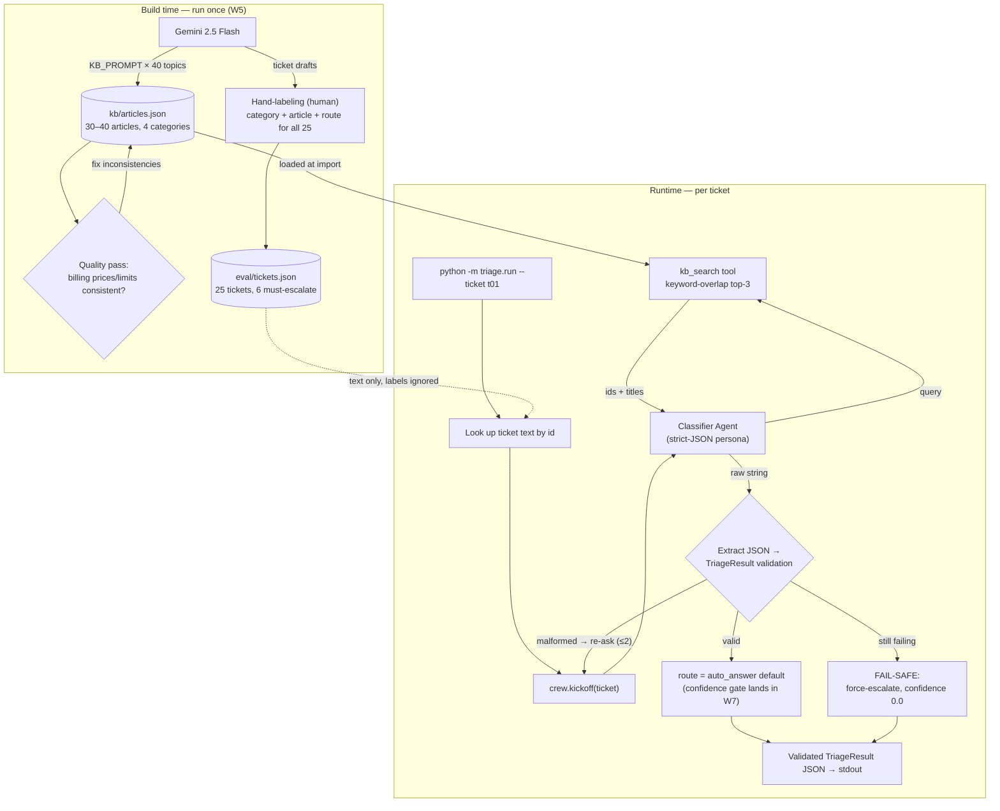
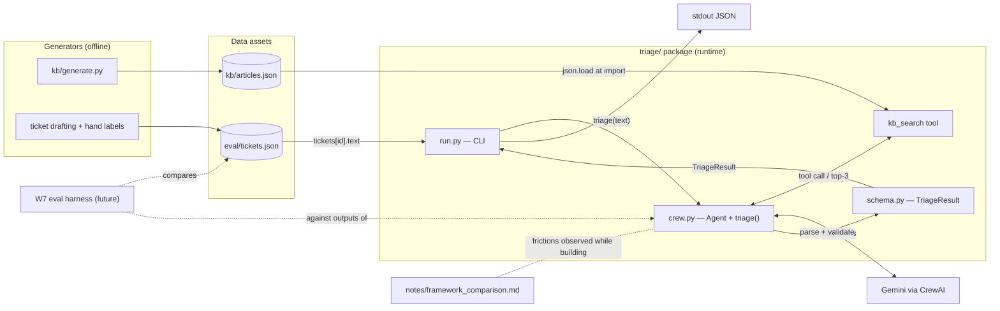

# TriageDesk — W5 Plan (Full Spec Scope)

Per spec §5, unreduced: KB 30–40 articles · 25 labeled tickets · classifier agent +
retriever tool wired · Pydantic schema from day one · exit = one ticket end-to-end via CLI.

---

## Goal

Build **TriageDesk**: an AI-powered support-ticket triage system for *CloudNote*
(a fictional SaaS note-taking app) that takes a raw customer ticket and produces one
validated, structured decision — **what category it belongs to, which KB article
answers it, and whether it can be auto-answered or must be escalated to a human** —
with the system *failing safe* (force-escalate) whenever the AI output can't be
trusted.

Meta-goal: a W5 curriculum milestone to build the same class of agentic system in
**CrewAI** that cardwise-ai built in LangGraph, so framework frictions can be
compared honestly (`notes/framework_comparison.md`).

## Objectives (measurable, per spec §5)

1. **Own the ground truth** — author a 30–40 article CloudNote KB across 4 categories
   (billing / troubleshooting / account / features). Because you wrote every fact,
   retrieval and escalation metrics become *measurable* instead of vibes.
2. **Build the eval foundation** — 25 hand-labeled tickets with full ground truth
   (category, article, route), including **6 must-escalate cases**. Signature metric:
   **100% escalation recall on those 6 by Week 7**.
3. **Contract-first design** — the `TriageResult` Pydantic schema (category,
   confidence, kb_article_id, drafted_reply, route) exists from day one; every output
   of the system is validated against it (spec C4).
4. **Wire the agent** — a CrewAI classifier agent using a `kb_search` retriever tool,
   outputting strict JSON only.
5. **Fail safe by policy, not by luck** — malformed output → re-ask ≤2 →
   force-escalate with confidence 0.0. An untrusted answer never reaches a customer
   (the C6 memo point: "the system fails safe").
6. **Exit criterion (W6 DoD)** — one ticket runs end-to-end via CLI
   (`python -m triage.run --ticket t01`) producing a validated `TriageResult`, with
   KB + tickets committed and the framework-comparison notes started.

**Explicit non-goals for W5:** the confidence-based routing gate and the full
eval-metrics run — both land in W7; for now `route` defaults to `auto_answer` unless
the fail-safe fires.

---

## High-level modules

Six modules, in build order:

| # | Module | Responsibility |
|---|--------|----------------|
| 1 | `kb/generate.py` → `kb/articles.json` | One-shot Gemini generator producing 30–40 CloudNote KB articles (8–10 per category), plus a manual consistency pass on billing facts |
| 2 | `eval/tickets.json` | 25 synthetic-but-hand-labeled tickets carrying full ground truth (category, article, route), incl. 6 must-escalate cases |
| 3 | `triage/schema.py` | The Pydantic contract — `TriageResult` is the single validated output type of the whole system, defined day one |
| 4 | `triage/crew.py` | CrewAI classifier agent + `kb_search` retriever tool + the `triage()` orchestrator (JSON parse → ≤2 retries → force-escalate fail-safe) |
| 5 | `triage/run.py` | CLI entry point: ticket id in → validated `TriageResult` JSON out (the W5 exit criterion) |
| 6 | `notes/framework_comparison.md` | Running log of CrewAI-vs-LangGraph frictions, started during the build |

**Key structural point:** modules 1–2 are **build-time data assets**; modules 3–5 are
the **runtime pipeline**. The runtime never sees the `expected_*` labels — those exist
only for the W7 eval.

---

## Diagram 1 — Overall app flow



---

## Diagram 2 — Module interactions



**Deliberate dependency direction:** `crew.py` depends on `schema.py`, never the
reverse — the schema is the stable contract everything else (CLI now, gate logic and
eval in W7) plugs into.

---

## Synthetic ticket data — source and structure

### Source (two-stage: LLM drafts, human labels)

1. **Draft text — Gemini, grounded in your own KB.** Prompt Gemini per ticket with
   (a) the target category, (b) one specific KB article's topic/body as the seed, and
   (c) a persona/tone (angry, confused, terse, non-native English). Seeding from a
   real article is the important trick — it guarantees every ticket has a resolvable
   `expected_article`, instead of free-floating complaints you can't label.
2. **The 6 must-escalate cases — trigger-driven, mostly hand-written.** One each:
   refund demand, legal threat, data loss, security incident, GDPR deletion, abusive
   tone. These are the signature metric (100% escalation recall by W7), so don't
   leave their wording to the LLM — write or heavily edit them yourself so the
   trigger is unambiguous.
3. **Labels — human only, all 25.** The LLM never assigns `expected_category`,
   `expected_article`, or `expected_route`. You authored the KB, so you're the
   ground-truth oracle; 25 is small enough to label properly in the 60m budget.

### Distribution

7 billing / 7 troubleshooting / 5 account / 6 features = 25.

Suggested spread of the 6 escalations:

| Trigger | Category |
|---------|----------|
| refund demand | billing |
| legal threat | billing |
| data loss | troubleshooting |
| security incident | account |
| GDPR deletion | account |
| abusive tone | any (should escalate regardless of topic — a good routing test) |

### Structure — `eval/tickets.json`, one record per ticket

```json
{
  "id": "t01",
  "text": "I was charged twice this month and I want a refund NOW.",
  "expected_category": "billing",
  "expected_article": "kb_billing_01",
  "expected_route": "escalate",
  "escalation_trigger": "refund_demand"
}
```

| Field | Type | Used by | Notes |
|-------|------|---------|-------|
| `id` | `"tNN"` string | CLI lookup, eval | Stable key |
| `text` | string | **runtime pipeline** | The *only* field the agent ever sees |
| `expected_category` | one of the 4 literals | eval only | Mirrors `TriageResult.category` |
| `expected_article` | KB id or `null` | eval only | `null` allowed when no single article applies (e.g. pure abuse) |
| `expected_route` | `auto_answer` \| `escalate` | eval only | Mirrors `TriageResult.route` |
| `escalation_trigger` | one of 6 trigger tags or `null` | eval only | Addition over the spec — lets W7 slice escalation recall per trigger, so a miss tells you *which* trigger the gate is blind to |

### Upstream pair — `kb/articles.json`

```json
{ "id": "kb_billing_01", "category": "billing", "title": "...", "body": "..." }
```

`id` is the join key between the KB, the ticket labels, and
`TriageResult.kb_article_id` — keep the `kb_{cat}_{i:02d}` naming exactly as the
spec has it.

---

## W6 Definition of Done (full scope)

- 30–40 articles committed
- 25 hand-labeled tickets (6 must-escalate)
- One ticket end-to-end via CLI producing a validated `TriageResult`
- `notes/framework_comparison.md` started with the first CrewAI-vs-LangGraph frictions
