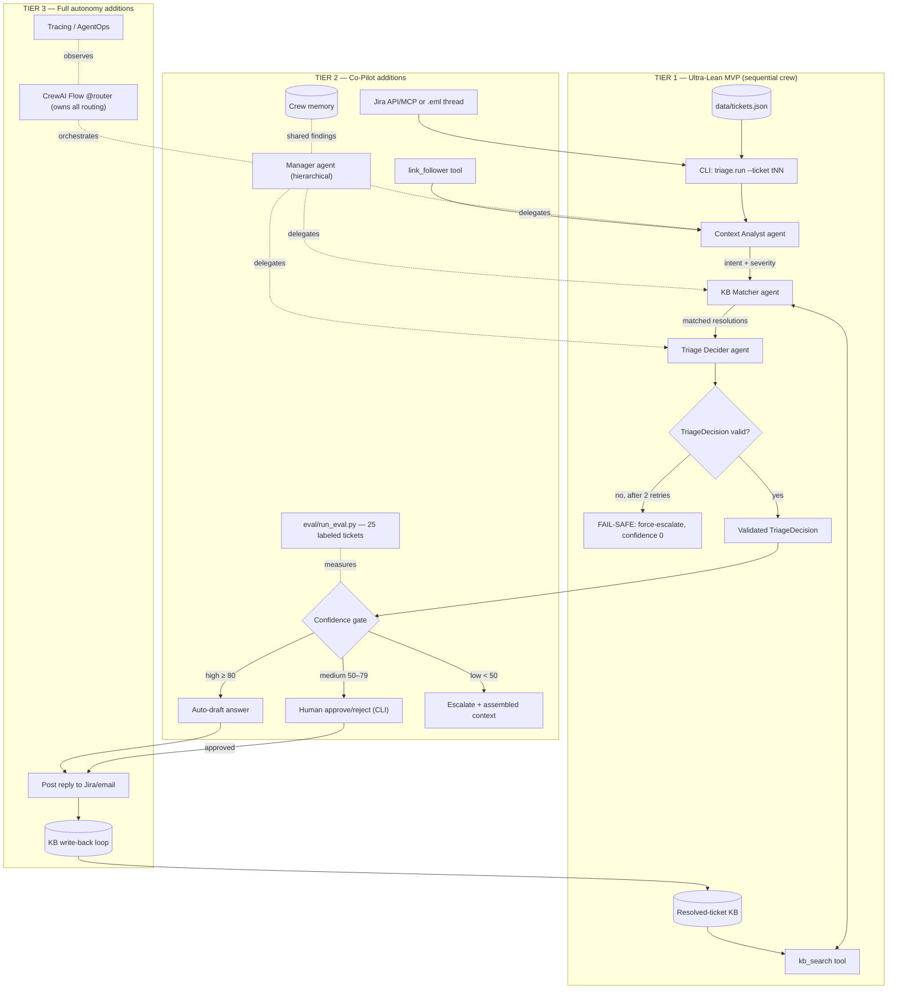

# Triage Desk — Project Plan (CrewAI, Three Scoping Tiers)

**Triage Desk** is an intelligent support-ticket resolution system: it ingests a ticket,
assembles its full context, matches it against a knowledge base of previously resolved
tickets, computes a confidence score, and then **auto-answers, suggests-and-escalates,
or escalates to a human** — never shipping an untrusted answer.

**Builder context:** transitioning SE → AI Engineer. The learning target is hands-on
mastery of **multi-agent architectures in CrewAI** — agent roles and delegation, tool
use, memory/state, task chaining, and guardrails.

The three options below are **strict supersets**: Option 1 ⊂ Option 2 ⊂ Option 3.
Start at Tier 1; each later tier only adds modules — nothing is thrown away.

---

## Tier comparison at a glance

| | Option 1 — Ultra-Lean MVP | Option 2 — Actionable Co-Pilot ⭐ | Option 3 — Full Autonomous System |
|---|---|---|---|
| **One-liner** | 3-agent sequential crew triaging local mock tickets | Hierarchical crew + memory + one real source + human approval gate | Multi-source, Flows-orchestrated, auto-posting, self-improving |
| **Orchestration** | `Process.sequential`, fixed task chain | `Process.hierarchical` — manager LLM delegates to specialists | CrewAI **Flows** (`@start/@listen/@router`) composing multiple crews |
| **Ingestion** | Local `tickets.json` (mock Freshdesk export) | + ONE real source: Jira API/MCP *or* `.eml` email threads; link-follower tool for embedded log URLs | + Multi-source (Jira **and** email), autonomous link/DB-reference crawling |
| **KB matching** | Keyword `kb_search` tool over resolved-ticket KB | Embedding search (Chroma) wrapped as a CrewAI tool | + Resolved tickets written back into the KB (learning loop) |
| **Decision engine** | Confidence 0–100 + route in one Decider agent | + Required-vs-optional action separation; confidence rubric enforced by guardrail | + Flow-level router owns all routing policy |
| **Resolution side** | Route printed with drafted reply (no sending) | Confidence gate → auto-draft / **HITL approve via CLI** / escalate with context | + Actually posts replies back to Jira/email |
| **Safety** | Pydantic-validated output; ≤2 retries → force-escalate | + HITL as a first-class routing outcome; low confidence always escalates | + Topology-encoded policy, observability (tracing/AgentOps) |
| **Eval** | Manual spot-checks on 10–15 mock tickets | Scripted eval over a 25-ticket labeled set: escalation recall + routing accuracy | + Regression harness re-run after every KB write-back |
| **Effort (build + buffer)** | **3 + 1 = 4 days** | **5.5 + 1.5 = 7 days** | **13 + 3 = 16 days (~3 weeks)** |
| **1-week verdict** | Comfortable | Tight but feasible (descope lever below) | **Not feasible in 1 week** — a 3-week roadmap where Week 1 = Option 2 |
| **Key learnings** | CrewAI primitives (Agent/Task/Crew/Process), role design, custom tools, task chaining, structured outputs, guardrails-as-code | + Hierarchical delegation, crew memory (short-term/entity), HITL gates, wrapping real systems as tools, evaluating a multi-agent pipeline | + Flows vs Crews, multi-crew composition, long-term memory, learning loops, production observability |

**Descope lever (Option 2):** if the week slips, drop the real ingestion source (stay on
mock tickets) — delegation, memory, HITL, and eval all survive intact.

---

## 1. Goals

- **Strategic:** a working triage system that turns a raw support ticket into one
  validated decision — answer, suggest, or escalate — and **fails safe** (force-escalate)
  whenever its own output can't be trusted.
- **Learning ladder (the real goal):**
  - *Tier 1:* think in **crews** — decompose triage into specialist agent roles with
    chained tasks instead of one prompt-orchestrated loop.
  - *Tier 2:* master what makes CrewAI distinct — **manager-led delegation, shared crew
    memory, guardrails as routing policy, human-in-the-loop** as a first-class outcome,
    and tools over real systems.
  - *Tier 3:* production shape — **Flows** for deterministic multi-crew orchestration,
    write-back learning, observability.

## 2. Objectives (measurable, per tier)

**Tier 1 (Option 1) — by Day 4**
1. Data assets committed: a resolved-ticket KB (~30 historical tickets with resolutions,
   4 issue categories) + 10–15 incoming mock tickets, both synthetic.
2. `TriageDecision` Pydantic schema (category, confidence 0–100, matched_kb_ids,
   drafted_reply, required_actions, optional_actions, route) exists from day one; every
   system output validates against it.
3. Sequential crew runs end-to-end: `python -m triage.run --ticket t07` → validated JSON.
4. Fail-safe proven: a malformed LLM output triggers ≤2 retries, then force-escalate
   with confidence 0.

**Tier 2 (Option 2) — by Day 7**
5. Crew runs under `Process.hierarchical`; the manager's delegation is visible in the trace.
6. Crew memory on: the Decider demonstrably uses a fact only the Context agent uncovered.
7. Embedding-based `kb_search` (Chroma); one real ingestion path (Jira issue *or* `.eml`
   thread → ticket schema); link-follower tool folds a linked log file into context.
8. Confidence gate live: ≥ 80 auto-draft · 50–79 human approve/reject at the CLI ·
   < 50 escalate with assembled context.
9. Eval over a 25-ticket labeled set: **100% escalation recall on must-escalate cases**,
   routing accuracy reported.

**Tier 3 (Option 3) — Weeks 2–3**
10. A CrewAI Flow routes tickets across ingestion / triage / resolution crews via `@router`.
11. High-confidence and human-approved answers post back to Jira/email; resolutions
    append to the KB.
12. Tracing dashboards live; eval re-run shows no regression after the learning loop.

## 3. Scope of the Project

**In scope** — per tier: see the comparison table (each tier = previous tier + its column deltas).

**Out of scope at every tier:**
- Freshdesk integration and any live production credentials or SLAs
- Web UI (CLI only; Streamlit is a stretch goal, not scope)
- Model fine-tuning; multi-tenant or auth concerns
- Auto-posting without a confidence gate — never ships in any tier

## 4. Modules & Agent Roles

**Tier 1 — core (Option 1)**

| Module | Responsibility |
|---|---|
| `data/kb.json` · `data/tickets.json` | Synthetic resolved-ticket KB + incoming mock tickets (build-time assets; eval labels never reach the runtime) |
| `triage/schema.py` | `TriageDecision` Pydantic contract — the single validated output type |
| `triage/crew.py` | The crew: **Context Analyst** (intent, entities, severity) → **KB Matcher** (owns `kb_search`) → **Triage Decider** (confidence, actions, route) |
| `triage/tools/kb_search.py` | Custom `BaseTool`: keyword top-3 over the resolved-ticket KB |
| `triage/run.py` | CLI entry: ticket id in → validated `TriageDecision` out; retry + fail-safe wrapper |

**Tier 2 — additions (Option 2)**

| Module | Responsibility |
|---|---|
| Manager agent (`Process.hierarchical`) | Delegates to the three specialists; replaces the fixed sequence |
| Crew memory (short-term + entity) | Findings shared across tasks within a run |
| `triage/tools/kb_search.py` v2 | Chroma embedding retrieval |
| `ingest/jira.py` *or* `ingest/eml.py` | ONE real source → ticket schema |
| `triage/tools/link_follower.py` | Fetches log URLs found in ticket text into context |
| `triage/gate.py` | Confidence gate + HITL CLI approve/reject for the medium band |
| `eval/run_eval.py` | Scripted eval over the 25-ticket labeled set |

**Tier 3 — additions (Option 3)**

| Module | Responsibility |
|---|---|
| `flows/triage_flow.py` | CrewAI Flow: `@start` ingestion → `@router` confidence routing → resolution or escalation crew |
| `ingest/` (both sources) | Jira + email, autonomous link/log crawling crew |
| `actions/poster.py` | Posts approved / high-confidence replies back to the source system |
| `kb/writeback.py` | Appends resolved tickets to the KB (learning loop) |
| Observability | AgentOps/tracing + regression eval harness |

## 5. Module & Agent Interactions

- **Tier 1 (sequential relay):** the CLI loads a ticket and kicks off the crew. The
  Context Analyst's output feeds the KB Matcher via `context=[analyst_task]`; the
  Matcher calls `kb_search` and passes matched resolutions plus the analysis to the
  Decider (`output_pydantic=TriageDecision`). A guardrail validates the result;
  malformed → ≤2 retries → force-escalate. Context moves **only** through explicit task
  chaining — the baseline Tier 2 is measured against.
- **Tier 2 (delegated + shared memory):** the Manager receives the triage goal and
  *decides* which specialist handles what — delegation replaces hardcoded order. Crew
  memory lets agents reuse each other's findings without stuffing everything into task
  outputs. Upstream, ingestion + the link-follower assemble richer context before
  kickoff; downstream, the validated `TriageDecision` hits the confidence gate — high
  auto-drafts, medium pauses for a human verdict at the CLI, low escalates with the
  assembled context attached.
- **Tier 3 (Flow-orchestrated crews):** a deterministic Flow owns routing *between whole
  crews* — ingestion crew → triage crew → (router) → resolution crew or escalation path —
  so the **topology encodes the safety policy, not the prompts**. Posted resolutions
  write back to the KB, improving future matching.

## 6. Flow Diagram

---

## Effort & buffer summary

| Tier | Build days | Buffer | Total | Day-by-day |
|---|---|---|---|---|
| Option 1 | 3 | 1 | **4 days** | D1 data assets + schema · D2 crew + tools · D3 guardrail + CLI + tests · D4 buffer/README |
| Option 2 | 5.5 | 1.5 | **7 days** | D1–2 = Option 1 core · D3 hierarchical + memory · D4 real source + link-follower · D5 gate + HITL · D6 eval · D7 buffer |
| Option 3 | 13 | 3 | **~16 days** | Week 1 = Option 2 · Week 2 Flows + 2nd source + posting · Week 3 write-back + observability + buffer |

Buffer days are real scope: LLM-output flakiness, CrewAI version quirks, and
integration auth historically eat ~20% of agentic-project time.
